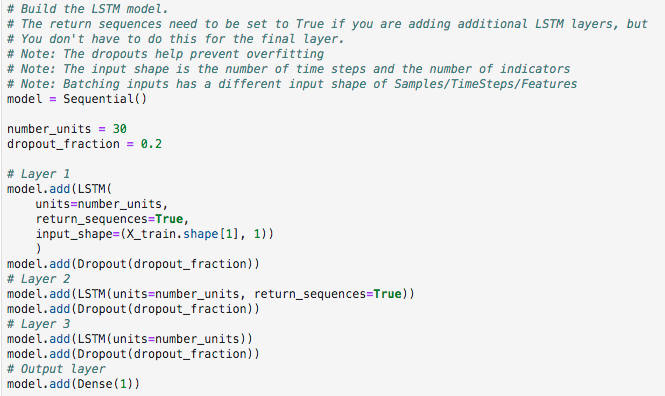
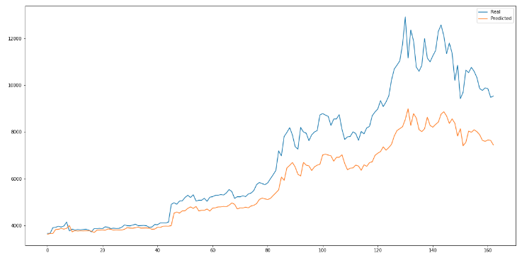

# Long Short Time Memory Stock Predictor

Due to the volatility of cryptocurrency speculation, investors will often try to incorporate sentiment from social media and news articles to help guide their trading strategies. One such indicator is the [Crypto Fear and Greed Index (FNG)](https://alternative.me/crypto/fear-and-greed-index/) which attempts to use a variety of data sources to produce a daily FNG value for cryptocurrency. I developed and evaluated deep learning models using both the FNG values and simple closing prices to determine if the FNG indicator provides a better signal for cryptocurrencies than the normal closing price data.

I used Deep Learning Recurrent Neural Networks to model bitcoin closing prices. One model will use the FNG indicators to predict the closing price while the second model will use a window of closing prices to predict the nth closing price.

- - -

### Prepared the data for training and testing

1. For each model, I used 70% of the data for training and 30% of the data for testing.

2. Applied a MinMaxScaler to scale the data for the model.

3. Finally, reshaped the data to fit the model's requirement of (samples, time steps, features).

### Build and train custom LSTM RNNs

In each Jupyter Notebook, create the same custom LSTM RNN architecture. In one notebook, you will fit the data using the FNG values. In the second notebook, you will fit the data using only closing prices.

Use the same parameters and training steps for each model. This is necessary to compare each model accurately.

### Evaluate the performance of each model

Finally, use the testing data to evaluate each model and compare the performance.

### The Architecture of the model 

In each Jupyter Notebook, created the same custom LSTM RNN architecture. 

Used the same parameters and training steps for each model. This was necessary to compare each model accurately.

## Model Performance

The model performed as follow:

- - -
